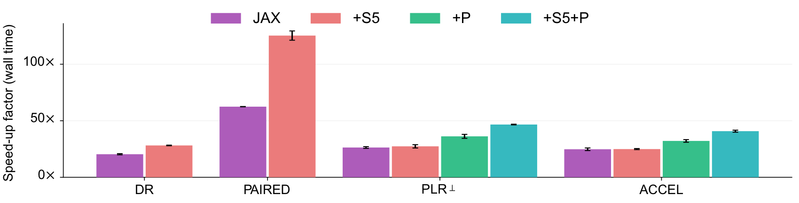
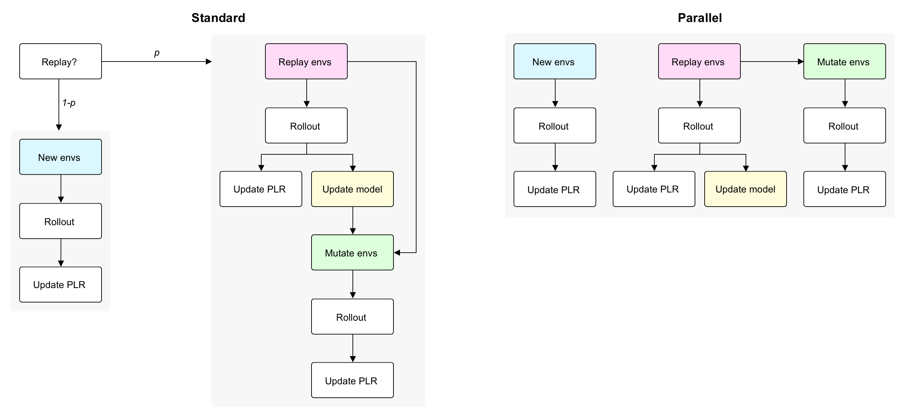
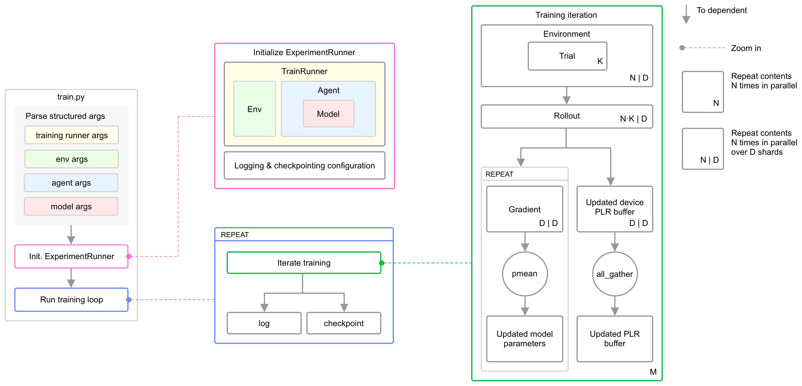

<h1 align="center"></h1>

<h3 align="center"><i>Efficient baselines for autocurricula in JAX</i></h3>

<p align="center">
	<a href="https://opensource.org/licenses/Apache-2.0"></a>
	<a href="https://pypi.python.org/pypi/minimax-lib"></a>
	<a href= "https://drive.google.com/drive/folders/15Vi7OsY6OrVaM5ZnY3Bt7J-0s5o_KV9b?usp=drive_link"></a>   
	<a href="https://arxiv.org/abs/2311.12716"></a>
</p>

## Contents
- [Why `minimax`?](#-why-minimax)
    - [Hardware-accelerated baselines](#-hardware-accelerated-baselines)
- [Install](#%EF%B8%8F-install)
- [Quick start](#-quick-start)
- [Dive deeper](#-dive-deeper)
    - [Training](#training)
    - [Logging](#logging)
    - [Checkpointing](#checkpointing)
    - [Evaluating](#evaluating)
- [Environments](#%EF%B8%8F-environments)
	- [Supported environments](#supported-environments)
	- [Adding environments](#adding-environments)
- [Agents](#-agents)
- [Roadmap](#-roadmap)
- [License](#-license)
- [Citation](#-citation)

## 🐢 Why `minimax`?

Unsupervised Environment Design (UED) is a promising approach to generating autocurricula for training robust deep reinforcement learning (RL) agents. However, existing implementations of common baselines require excessive amounts of compute. In some cases, experiments can require more than a week to complete using V100 GPUs. **This long turn-around slows the rate of research progress in autocuriculum methods**. `minimax` provides fast, [JAX-based](https://github.com/google/jax) implementations of key UED baselines, which are based on the concept of _minimax_ regret. By making use of fully-tensorized environment implementations, `minimax` baselines are fully-jittable and thus take full advantage of the hardware acceleration offered by JAX. In timing studies done on V100 GPUs and Xeon E5-2698 v4 CPUs, we find `minimax` baselines can run **over 100x faster than previous reference implementations**, like those in [facebookresearch/dcd](https://github.com/facebookresearch/dcd).

All autocurriculum algorithms implemented in `minimax` also support multi-device training, which can be activated through a [single command line flag](#multi-device-training). Using multiple devices for training can lead to further speed ups and allows scaling these autocurriculum methods to much larger batch sizes.

<picture>
  <source media="(prefers-color-scheme: dark)" srcset="docs/images/minimax_speedups_darkmode.png#gh-dark-mode-only">
  
</picture>

### 🐇 Hardware-accelerated baselines

`minimax` includes JAX-based implementations of 

- [Domain Randomization (DR)](https://arxiv.org/abs/1703.06907)

- [Minimax adversary](https://arxiv.org/abs/2012.02096)

- [PAIRED](https://arxiv.org/abs/2012.02096)

- [Population PAIRED](https://arxiv.org/abs/2012.02096)

- [Prioritized Level Replay (PLR)](https://arxiv.org/abs/2010.03934)

- [Robust Prioritized Level Replay (PLR$`^{\perp}`$)](https://arxiv.org/abs/2110.02439)

- [ACCEL](https://arxiv.org/abs/2203.01302)

Additionally, `minimax` includes two new variants of PLR and ACCEL that further reduce wall time by better leveraging the massive degree of environment parallelism enabled by JAX:

- Parallel PLR (PLR$`^{||}`$)

- Parallel ACCEL (ACCEL$`^{||}`$)

In brief, these two new algorithms collect rollouts for new level evaluation, level replay, and, in the case of Parallel ACCEL, mutation evaluation, all in parallel (i.e. rather than sequentially, as done by Robust PLR and ACCEL). As a simple example for why this parallelization improves wall time, consider how Robust PLR with replay probability of `0.5` would require approximately 2x as many rollouts in order to reach the same number of RL updates as a method like DR, because updates are only performed on rollouts based on level replay. Parallelizing level replay rollouts alongside new level evaluation rollouts by using 2x the environment parallelism reduces the total number of parallel rollouts to equal the total number of updates desired, thereby matching the 1:1 rollout to update ratio of DR. The diagram below summarizes this difference.



`minimax` includes a fully-tensorized implementation of a maze environment that we call [`AMaze`](docs/envs/maze.md). This environment exactly reproduces the MiniGrid-based mazes used in previous UED studies in terms of dynamics, reward function, observation space, and action space, while running many orders of magnitude faster in wall time, with increasing environment parallelism.


## 🛠️ Install

1. Use a virtual environment manager like `conda` or `mamba` to create a new environment for your project:

```bash
conda create -n minimax
conda activate minimax
```

2. Install `minimax` via either `pip install minimax-lib` or `pip install ued`. 

3. That's it!

⚠️ Note that to enable hardware acceleration on GPU, you will need to make sure to install the latest version of `jax>=0.4.19` and `jaxlib>=0.4.19` that is compatible with your CUDA driver (requires minimum CUDA version of `11.8`). See [the official JAX installation guide](https://jax.readthedocs.io/en/latest/installation.html#pip-installation-gpu-cuda-installed-via-pip-easier) for detailed instructions.

## 🏁 Quick start

The easiest way to get started is to play with the Python notebooks in the [examples folder](examples) of this repository. We also host Colab versions of these notebooks:

- DR [[IPython](examples/dr.ipynb), [Colab](https://colab.research.google.com/drive/1HhgQgcbt77uEtKnV1uSzDsWEMlqknEAM)]

- PAIRED [[IPython](examples/paired.ipynb), [Colab](https://colab.research.google.com/drive/1NjMNbQ4dgn8f5rt154JKDnXmQ1yV0GbT?usp=drive_link)]

- PLR and ACCEL*: [[IPython](examples/plr.ipynb), [Colab](https://colab.research.google.com/drive/1XqVRgcIXiMDrznMIQH7wEXjGZUdCYoG9?usp=drive_link)]

*Depending on how the top-level flags are set, this notebook runs PLR, Robust PLR, Parallel PLR, ACCEL, or Parallel ACCEL.

`minimax` comes with high-performing hyperparameter configurations for several algorithms, including domain randomization (DR), PAIRED, PLR, and ACCEL for 60-block mazes. You can train using these settings by first creating the training command for executing `minimax.train` using the convenience script [`minimax.config.make_cmd`](docs/make_cmd.md):

`python -m minimax.config.make_cmd --config maze/[dr,paired,plr,accel] | pbcopy`,

followed by pasting and executing the resulting command into the command line. 

[See the docs](docs/make_cmd.md) for `minimax.config.make_cmd` to learn more about how to use this script to generate training commands from JSON configurations. You can browse the available JSON configurations for various autocurriculum methods in the [configs folder](config/configs).

Note that when logging and checkpointing are enabled, the main `minimax.train` script outputs this data as `logs.csv` and `checkpoint.pkl` respectively in an experiment directory located at `<log_dir>/<xpid>`, where `log_dir` and `xpid` are arguments specified in the command. You can then evaluate the checkpoint by using  `minimax.evaluate`:

```bash
python -m minimax.evaluate \
--seed 1 \
--log_dir <absolute path log directory> \
--xpid_prefix <select checkpoints with xpids matching this prefix> \
--env_names <csv string of test environment names> \
--n_episodes <number of trials per test environment> \
--results_path <path to results folder> \
--results_fname <filename of output results csv>
```

## 🪸 Dive deeper



### Training

The main entry for training is `minimax.train`. This script configures the training run based on command line arguments. It constructs an instance of `ExperimentRunner` to manage the training process on an update-cycle basis: These duties include constructing and delegating updates to an appropriate training runner for the specified autocurriculum algorithm and conducting logging and checkpointing. The training runner used by `ExperimentRunner` executes all autocurriculum-related logic. The system diagram above describes how these pieces fit together, as well as how `minimax` manages various, hierarchical batch dimensions.

Currently, `minimax` includes training runners for the following classes of autocurricula:

| **Runner**     | **Algorithm class**                                           | **`--train_runner`** |
| -------------- | ------------------------------------------------------------- | --------------------- |
| `DRRunner`     | Domain randomization                                          | `dr`                  |
| `PLRRunner`    | Replay-based curricula, including ACCEL                       | `plr`                 |
| `PAIREDRunner` | Curricula via a co-adapting teacher environment design policy | `paired`              |

The below table summarizes how various autocurriculum methods map to these runners and the key arguments that must be set differently from the default settings in order to switch the runner's behavior to each method.

| **Algorithm**  | **Reference** | **Runner** | **Key args** |
| - | - | - | - |
| DR  | [Tobin et al, 2019](https://arxiv.org/abs/1703.06907) | `DRRunner` | – |
| Minimax adversary      | [Dennis et al, 2020](https://arxiv.org/abs/2012.02096) | `PAIREDRunner` | `ued_score='neg_return'` |
| PAIRED            | [Dennis et al, 2020](https://arxiv.org/abs/2012.02096)          | `PAIREDRunner` | – |
| Population PAIRED | [Dennis et al, 2020](https://arxiv.org/abs/2012.02096)          | `PAIREDRunner` | `n_students >= 2`, `ued_score='population_regret'` |
| PLR               | [Jiang et al, 2021](https://arxiv.org/abs/2010.03934)           | `PLRRunner`    | `plr_use_robust_plr=False` |
| Robust PLR        | [Jiang et al, 2021a](https://arxiv.org/abs/2110.02439)           | `PLRRunner`    | – |
| ACCEL             | [Parker-Holder et al, 2022](https://arxiv.org/abs/2203.01302)   | `PLRRunner`    | `plr_mutation_fn != None`, `plr_n_mutations > 0` |
| Parallel PLR      | [Jiang et al, 2023](https://openreview.net/forum?id=vxZgTbmC4L) | `PLRRunner`    | `plr_use_parallel_eval=True` |
| Parallel ACCEL    | [Jiang et al, 2023](https://openreview.net/forum?id=vxZgTbmC4L) | `PLRRunner`    | `plr_use_parallel_eval=True`, `plr_mutation_fn != None`, `plr_n_mutations > 0`|

[See the docs](docs/train_args.md) on `minimax.train` for a comprehensive guide on how to configure command-line arguments for running various autocurricula methods via `minimax.train`.

### Logging

By default, `minimax.train` generates a folder in the directory specified by the `--log_dir` argument, named according to `--xpid`. This folder contains the main training logs, `logs.csv`, which are updated with a new row every `--log_interval` rollout cycles.

### Checkpointing

**Latest checkpoint:**
The latest model checkpoint is saved as `checkpoint.pkl`. The model is checkpointed every `--checkpoint_interval` number of updates, where each update corresponds to a full rollout and update cycle for each participating agent. For the same number of environment interaction steps, methods may differ in the number of gradient updates performed by participating agents, so checkpointing based on number of update cycles controls for this potential discrepency. For example, methods based on Robust PLR, like ACCEL, do not perform student gradient updates every rollout cycle.

**Archived checkpoints:**
Separate archived model checkpoints can be saved at specific intervals by specifying a positive value for the argument `--archive_interval`. For example, setting `--archive_interval=1000`  will result in saving model checkpoints every 1000 updates, named `checkpoint_1000.tar`, `checkpoint_2000.tar`, and so on. These archived models are saved in addition to `checkpoint.pkl`, which always stores the latest checkpoint, based on `--checkpoint_interval`.

### Evaluating

Once training completes, you can evaluate the resulting `checkpoint.pkl` on test environments using `minimax.evaluate`. This script can evaluate an individual checkpoint or group of checkpoints created via training runs with a shared experiment ID prefix (`--xpid` value), e.g. each corresponding to different training seeds of the same experiment configuration. Each checkpoint is evaluated over `--n_episodes` episodes for each of the test environments, specified via a csv string of test environment names passed in via `--env_names`. The evaluation results can be optionally written to a csv file in `--results_path`, if a `--results_fname` is provided. 

[See the docs](docs/evaluate_args.md) on `minimax.evaluation` for a comprehensive guide on how to configure command line arguments for `minimax.evaluate`.

### Multi-device training

All autocurriculum algorithms in `minimax` support multi-device training via `shmap` across the environment batch dimension (see the system diagram above). In order to shard rollouts and gradient updates along the environment batch dimension across `N` devices, simply pass `minimax.train` the additional argument `--n_devices=N`. By default, `n_devices=1`.


## 🏝️ Environments

### Supported environments


`minimax` currently includes [`AMaze`](docs/envs/maze.md), a fully-tensorized implementation of the partially-observable maze navigation environments featured in previous UED studies (see example `AMaze` environments in the figure above). The `minimax` implementation of the maze environment fully replicates the original MiniGrid-based dynamics, reward functions, observation space, action space. See the environment docs fo more details.

We look forward to working with the greater RL community in continually expanding the set of environments integrated with `minimax`.

### Adding environments

In order to integrate into `minimax`'s fully-jittable training logic, environments should be implemented in a tensorized fashion via JAX.  All environments must implement the `Environment` interface. At a high level, `Environment` subclasses should implement reset and step logic assuming a single environment instance (no environment parallelism). Parallelism is automatically achieved via the training runner logic included with`minimax` (See the [paper]() and system diagram above for a quick overview of how this is performed). 

A key design decision of `minimax` is to separate environment parameters into two groups: 

- **Static parameters** are fixed throughout training. These parameters are frozen hyperparameters defining some unchanging aspect of the underlying environment distribution, e.g. the width, height, or maximum number of walls of maze environments considered during training. These static parameters are encapsulated in an `EnvParams` dataclass. 

- **Free parameters** can change per environment instance (e.g. across each instance in a parallel rollout batch). These parameters might correspond to aspects like the specific wall map defining the maze layout or the starting position of the agent. Free parameters are simply treated as part of the fully-traceable `EnvState`, taking the form of an arbitrary pytree.

All environments supporting the `Environment` interface will interoperate with `DRRunner` and `PLRRunner` (though for ACCEL mode, where `mutation_fn != None`, a mutation operator [must additionally be defined](#environment-operators)).

#### Environment design with a co-adapting teacher policy

In PAIRED-style autocurricula, a teacher policy generates environment instances in order to maximize some curriculum objective, e.g. relative regret. The teacher's decision-making process corresponds to its own MDP. 

To support such autocurricula, `minimax` follows the pattern of implementing separate `Environment` subclasses for each of student and teacher MDPs. A convenience class called `UEDEnvironment` is then initialized with instances of the student and teacher MDPs. The `UEDEnvironment` instance exposes a unified interface for resetting and stepping the teacher and student, which is then used in the training runner. For example, stepping the `UEDEnvironment` instance for the teacher (via the `step_teacher` method) produces an environment instance, which can then be used with the `reset_student` method to reset the state of the UEDEnvironment object to that particular environment instance. Subsequent calls of the `step_student` method then operate within this environment instance. Following this pattern, integration of a new environment with `PAIREDRunner` requires implementing the corresponding `Environment` subclass for the teacher MDP (the decision process ). See [`minimax/envs/maze/maze_ued.py`](src/minimax/envs/maze/maze_ued.py) for an example based on the maze environment.

#### Environment operators

Custom environment operators can also be defined in `minimax`.

- **Comparators** take two environment instances, as represented by their `EnvState` pytrees and return `True` iff the two instances are deemed equal. If a comparator is registered for an environment, training runners can use the comparator to enforce uniqueness of environment instances for many purposes, e.g. making sure the members of the PLR buffer are all unique.

- **Mutators** take an environment instance, as represented by an `EnvState` pytree, and apply some modification to the instance, returning the modified (or "mutated") instance. Mutators are used by ACCEL to mutate environment instances in the PLR buffer. New environments seeking integration with the ACCEL mode of the `PLRRunner` should implement and register a default mutation operator.

#### Registration

Each new `Environment` subclass should be registered with the `envs` module:

- **Student environments** should be registered using `envs.registration.register`. See src/minimax/maze/maze.py for an example.

- **Teacher environments** should be registered using `envs.registration.register_ued`. See [`envs/maze/maze_ued.py`](src/minimax/envs/maze/maze_ued.py) for an example.

- **Mutators** should be registered using `envs.registration.register_mutator`. See `envs/maze/maze_mutators.py` for an example.

- **Comparators** should be registered using `envs.registration.register_comparator`. See `envs/maze/maze_comparators.py` for an example.

## 🤖 Agents

In `minimax` *agents* correspond to a particular data-seeking learning algorithm, e.g. PPO. A *model* corresponds to a module that implements the policy (or value function) used by the agent. Any agent that follows the [`Agent`](src/minimax/agents/agent.py) interface should be usable in any `minimax` compatible environment.

Model forward passes are assumed to return a tuple of `(value_prediction, policy_logits, carry)`. 

#### Registration

Custom model classes should be registered for a particular environment for which they are designed. See [`models/maze/gridworld_models.py`](src/minimax/models/maze/gridworld_models.py) for an example. After registration, the model can be easily retrieved and  via `models.make(env_name, model_name, **model_kwargs)`. 

## 🚀 Roadmap

Many exciting features are planned for future releases of `minimax`. Features planned for near-term release include:

- [ ] Add support for [JaxMARL](https://github.com/flairox/jaxmarl) (multi-agent RL environments) via an IPPO mode in `DRRunner` and `PLRRunner`.
- [ ] Extend `Parsnip` with methods for composing argument specs across multiple files to reduce the size of `arguments.py` currently used for `train.py`.
- [ ] Add support for [Jumanji](https://github.com/instadeepai/jumanji) (combinatorial optimization environments), via an appropriate decorator class.

You can suggest new features or ways to improve current functionality by creating an issue in this repository.

## 🪪 License

`minimax` is licensed under [Apache 2.0](LICENSE).

## 📜 Citation
For attribution in academic contexts, please cite this work as
```
@article{jiang2023minimax,
    title={minimax: Efficient Baselines for Autocurricula in JAX},
    author={Jiang, Minqi and Dennis, Michael and Grefenstette, Edward and Rocktäschel, Tim},
    booktitle={Agent Learning in Open-Endedness Workshop at NeurIPS},
    year={2023}
}
```