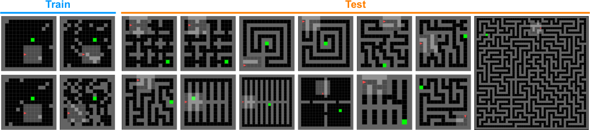

# `AMaze`

## 🧭 Partially-observable navigation in procedural mazes.

The `AMaze` environment reproduces the MiniGrid-based, partially-observable maze navigation environments featured in previous works. Specifically `AMaze` provides feature-parity with respect to the previous reference implementation of the maze environment in [facebookresearch/dcd](https://github.com/facebookresearch/dcd). 

## Student environment
View source: [`envs/maze/maze.py`](../../src/minimax/envs/maze/maze.py)

### Static EnvParams

The table below summarizes the configurable static environment parameters of `AMaze`. The parameters that can be provided via `minimax.train` by default are denoted in the table below. Their corresponding command-line argument is the name of the parameter, preceded by the prefix `maze`, e.g. `maze_n_walls` for specifying `n_walls`. 

Similarly, evaluation parameters can be specified via the prefix `maze_eval`, e.g. `maze_eval_see_agent` for specifying `see_agent`. Currently, `minimax.train` only accepts `maze_eval_see_agent` and `maze_eval_normalize_obs`.

Note that `AMaze` treats `height` and `width` as parameterizing only the portion of the maze grid that can vary, and thus excludes the 1-tile wall border surrounding each maze instance. Thus, a 15x15 maze in the prior `MiniGrid`-based implementation corresponds to an `AMaze` parameterization with `height=13` and `width=13`.

| Parameter | Description| Command-line support | 
| - | - | - |
| `height` | Height of maze | ✅ |
| `width` | Width of maze | ✅ |
| `n_walls` | Number of walls to place per maze | ✅ |
| `agent_view_size` | Size of foward-facing partial observation see by agent | ✅ |
| `replace_wall_pos` | Wall positions are sampled with replacement if `True` | ✅ |
| `see_agent` | Agent sees itself in its partial observation if `True` | ✅ |
| `normalize_obs`| Scale observation values to [0,1] if `True`| ✅ |
| `sample_n_walls` | Sample # walls placed between [0, `n_walls`] if `True` | ✅ |
| `obs_agent_pos` | Include `agent_pos` in the partial observation | ✅ |
| `max_episode_steps` | Maximum # steps per episode | ✅ |
| `singleton_seed` | Fix the random seed to this value, making the environment a singleton |  |

### State space
| Variable | Description|
| - | - |
| `agent_pos` | Agent's (x,y) position |
| `agent_dir` | Agent's orientation vector |
| `agent_dir_idx` | Agent's orientation enum |
| `goal_pos` | Goal (x,y) position |
| `wall_map` | H x W bool tensor, `True` in wall positions |
| `maze_map` | Full maze map with all objects for rendering |
| `time` | Time step |
| `terminal` | `True` iff episode is done |

### Observation space
| Variable | Description|
| - | - |
| `image`| Partial observation seen by agent |
| `agent_dir` | Agent's orientation enum |
| `agent_pos` | Agent's (x,y) position (not included by default) |

### Action space
| Action index | Description|
| - | - |
| `0` | Left |
| `1` | Right |
| `2` | Foward |
| `3` | Pick up |
| `4` | Drop |
| `5` | Toggle |
| `6` | Done |

Note that the navigation environments only use actions `0` through `2`, however all actions are included for parity with the original `MiniGrid`-based environments.

## Teacher environment
View source: [`envs/maze/maze_ued.py`](../../src/minimax/envs/maze/maze_ued.py)

To support autocurricula generated by a co-adapting teacher policy (e.g. PAIRED), `AMaze` includes `UEDMaze`, which implements the teacher's MDP for designing `Maze` instances. By design, a pair of `Maze` and `UEDMaze` objects (corresponding to a specific setting of `EnvParams`) can be wrapped into a `UEDEnvironment` object for use in a training runner (see `PAIREDRunner` for an example).

The parameters that can be provided via `minimax.train` by default are denoted in the table below. Their corresponding command-line argument is the name of the parameter, preceded by the prefix `maze_ued`, e.g. `maze_ued_n_walls` for specifying `n_walls`. Note that when the corresponding `maze_*` and `maze_ued_*` arguments conflict, those specified in `maze_*` take precedent.

### Static EnvParams
| Variable | Description| Command-line support |
| - | - | - |
| `height` | Height of maze | ✅ |
| `width` | Width of maze | ✅ |
| `n_walls` | Wall budget | ✅ |
| `noise_dim` | Size of noise vector in the observation | ✅ |
| `replace_wall_pos` | If `True`, placing an object over an existing way replaces it. Otherwise, the object is placed in a random unused position. | ✅ |
| `fixed_n_wall_steps` | First `n_walls` actions are wall positions if `True`. Otherwise, the first action only determines the fraction of wall budget to use. | ✅ |
| `first_wall_pos_sets_budget` | First wall position also determines the fraction of wall budget to use (rather than using a separate first action to separately determine this fraction) | ✅ |
| `set_agent_dir` | If `True`, the action in an extra last time step determines the agent's initial orientation index | ✅ |
| `normalize_obs` | If `True`, Scale observation values to [0,1] | ✅ |

### State space
| Variable | Description|
| - | - |
| `encoding` | `A 1D vector encoding the running action sequence of the teacher` |
| `time` | `current time step` |
| `terminal` | `True` if the episode is done |

### Observation space
| Variable | Description|
| - | - |
| `image` | Full `maze_map` of the maze instance under construction |
| `time` | Time step |
| `noise` | A noise vector sampled from Uniform(0,1) |

### Action space
The action space corresponds to integers in [0,`height*width`]. Each action corresponds to a selected wall location in the flattened maze grid, with the exception of the last two actions, which correspond to the goal position and the agent's starting position. This interpretation of the action sequence can change based on the specific configuration of `EnvParams`:

- If `params.replace_wall_pos=True`, the first action corresponds to the number of walls to place in the current episode.

- If `params.set_agent_dir=True`, an additional step is appended to the episode, where the action corresponds to the agent's initial orientation index.

## OOD test environments
The `AMaze` module includes the set of OOD, human-designed environments for testing zero-shot transfer from previous studies (See the figure above for a summary of these environments). Several of these environments are procedurally-generated: 

- `Maze-SmallCorridor`
- `Maze-LargeCorridor`
- `Maze-FourRooms`
- `Maze-Crossing`
- `Maze-PerfectMaze*`

The OOD maze environments are defined in [`envs/maze/maze_ood.py`](../minimax/envs/maze/maze_ood.py). They each subclass `Maze` and support customization via the `EnvParams` configuration, e.g. changing the default `height` or `width` values to generate larger or smaller instances.

